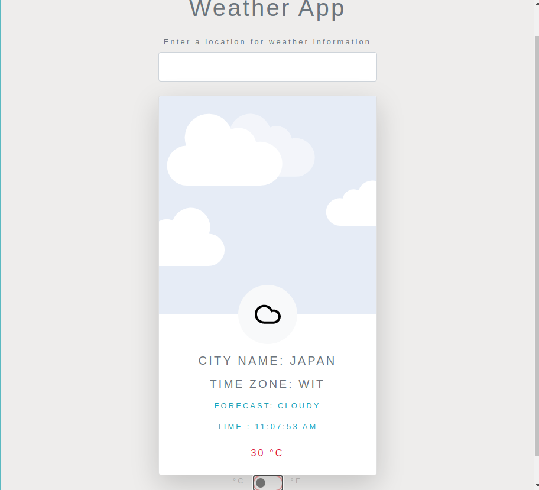

# Project: Weather App

> The idea of the project was to build a weather app using an API, the
> user will submit the city name in the input form and will get back
> information such as the English city name, forecast, temperature.
> The temperature is provided in Celcius and with a toggle button 
> can switch to Farenheight. 
> Also the main card will change between day and night depending on the > information from the API.

## Built With

- HTML / CSS
- Bootstrap
- Webpack
- Javascript

## Live Demo

[Live Demo Link](https://rawcdn.githack.com/cvilla714/weather-app/e69d6a5a8edc54b6dcffc98761f872ad1898e26f/dist/index.html)

## Getting Started

**To get a copy of the code please click on the green button on the top right corner that says Code**

### Prerequisites

- Node installed on your computer
- Npm as well

### Install

**Now to clone it to your local machine please open your terminal and paste this code `git clone git@github.com:cvilla714/weather-app.git`**

**Then you can go into the directory by typig `cd weather-app`**

**Next you need to access the brach by typing `git checkout weather`**

**Finally just type this command `npm install` this will install all of the depnedecies for the project**

### Usage

**Once you have gone through the process of installing the code you now run this command `npm run start` this will start the app and a new window will open in your browser with the app ready to be use**

## Authors

👤 **Cosmel Villalobos**

- Github: [@cvilla714](https://github.com/cvilla714)
- Twitter: [@kckeyti](https://twitter.com/kckeyti)
- LinkedIn: [Cosmel Villalobos](https://www.linkedin.com/in/cosvilla/)

## 🤝 Contributing

Contributions, issues, and feature requests are welcome!

Feel free to check the [issues page](https://github.com/cvilla714/weather-app/issues).

## Show your support

Give a ⭐️ if you like this project!

## 📝 License

This project is [MIT](https://github.com/cvilla714/weather-app/blob/development/LICENSE) licensed.
